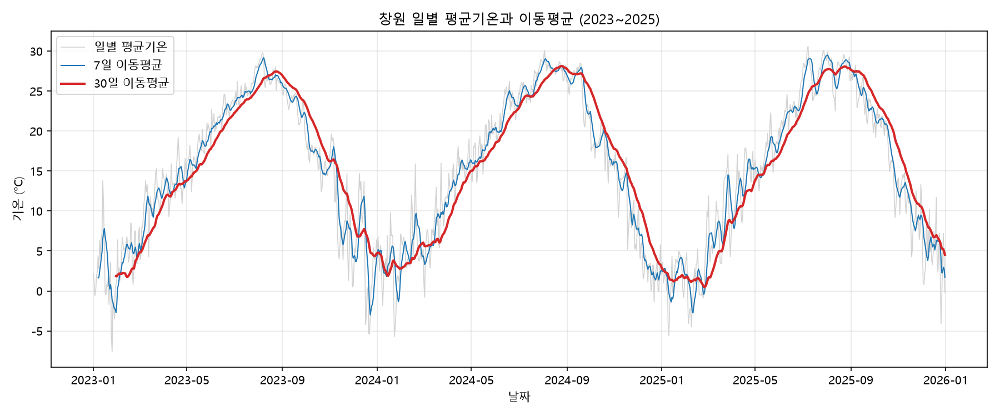
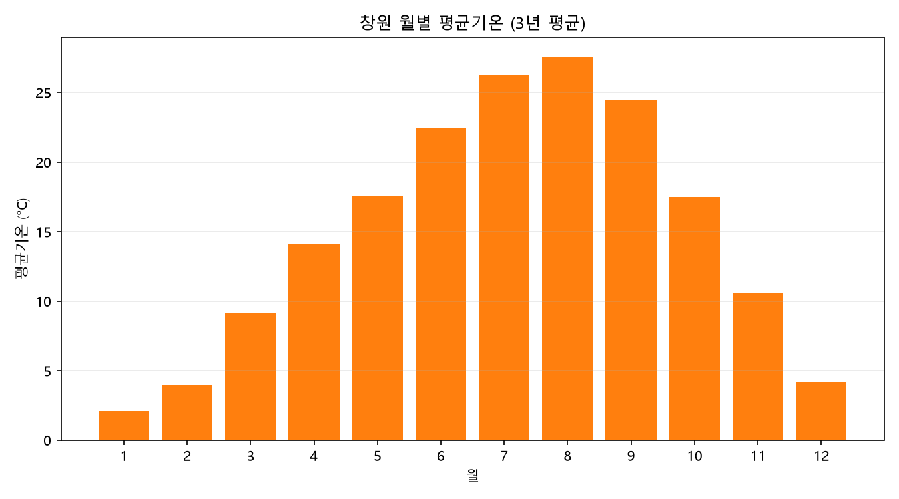
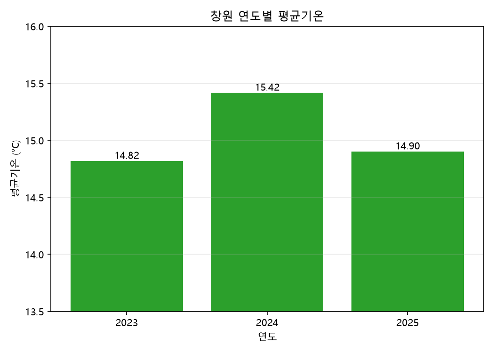
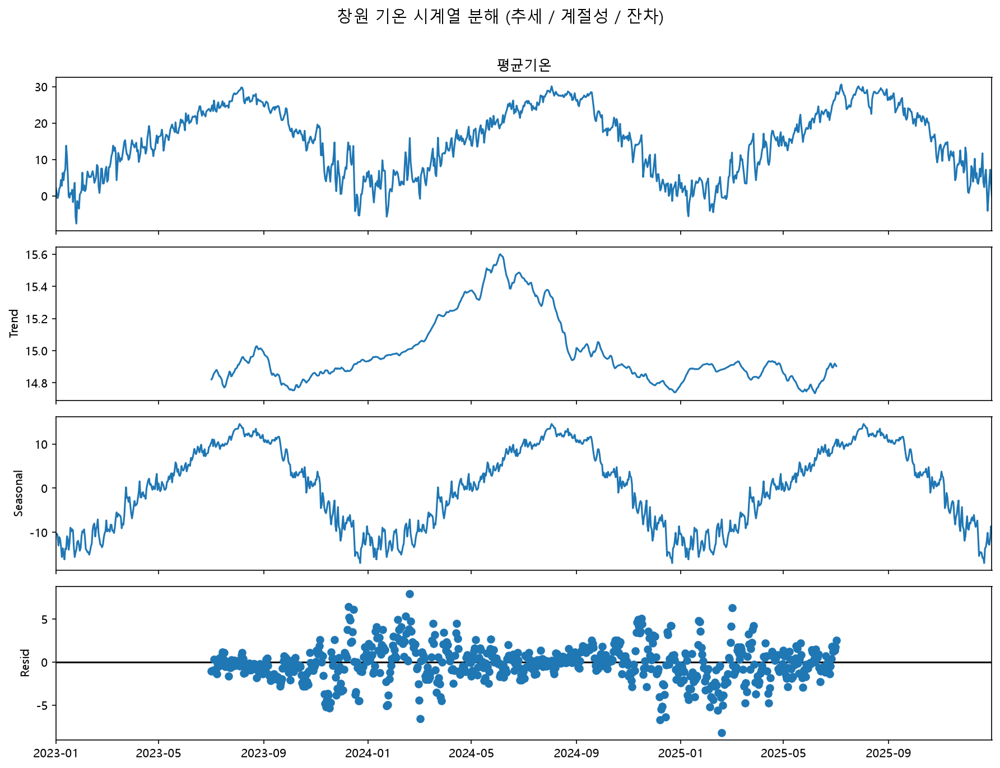

# 창원 기온 시계열 분석 리포트 (2023~2025)

## 1. 분석 주제 및 선정 이유

창원 지역의 일별 평균기온이 시간에 따라 어떻게 변해왔는지를 분석한다. 기온은 계절에 따라 규칙적으로 반복되는 대표적인 시계열 데이터이며, 누구나 직관적으로 이해할 수 있어 시계열의 핵심 개념(추세·계절성·노이즈)을 확인하기에 적합하다고 판단해 선정했다. 특히 최근 기후 변화에 대한 관심이 높은 만큼, "창원의 기온에 실제로 어떤 흐름이 있는가"를 데이터로 직접 확인해보고자 했다.

## 2. 분석 질문

1. 창원의 연평균 기온이 2023년 → 2025년 사이에 오르는(또는 내리는) 추세가 있는가?
2. 월별 기온 패턴은 매년 어떻게 반복되며, 가장 덥고 추운 달은 언제인가?
3. 하루 사이 기온 변동이 가장 큰 시기는 언제인가?

## 3. 데이터 설명

- **출처**: Open-Meteo Historical Weather API (archive-api.open-meteo.com)
- **지역**: 창원 (위도 35.23, 경도 128.68)
- **기간**: 2023-01-01 ~ 2025-12-31 (약 3년)
- **데이터 수**: 1,096일 (2024년 윤년 포함)
- **데이터 항목**: 일별 평균기온 (temperature_2m_mean, 단위 °C)
- **수집 방법**: Python `requests`로 API에 요청 → `pandas`로 표 변환 → `data/changwon_temperature_2023_2025.csv`로 저장
- **라이선스**: Open-Meteo (CC BY 4.0, 출처 표기 조건). "Weather data by Open-Meteo.com"

### 데이터 정제

결측치와 이상치를 점검한 결과, 빈 값이 0개였고 날짜도 빠짐없이 연속적(기간상 1,096일 = 실제 1,096일)이었으며 기온 값도 정상 범위(최고 30.6°C 등)였다. 따라서 별도의 정제 없이 원본 데이터를 그대로 사용했다.

### 적용한 시계열 분석 기법

- **이동평균(7일·30일)**: 일별 변동을 완화해 큰 흐름을 확인
- **변화율(전일 대비)**: 하루 사이 기온 변동이 큰 시기를 탐색
- **월별·연도별 집계**: 계절 패턴과 연도별 평균 비교
- **시계열 분해(보너스)**: 추세/계절성/잔차 분리

## 4. 분석 결과 및 시각화

### 4-1. 일별 평균기온과 이동평균

회색은 일별 평균기온, 파란선은 7일, 빨간선은 30일 이동평균이다. 일별 값은 매우 들쭉날쭉하지만, 30일 이동평균선을 보면 매년 여름에 높고 겨울에 낮은 부드러운 산 모양이 규칙적으로 반복된다.

### 4-2. 월별 평균기온

3년 평균 기준 월별 평균기온은 1월 2.1°C(최저)에서 시작해 8월 27.6°C(최고)까지 오른 뒤 다시 내려온다. 여름과 겨울의 차이는 약 25.5°C에 달한다.

| 월 | 1 | 2 | 3 | 4 | 5 | 6 | 7 | 8 | 9 | 10 | 11 | 12 |
|----|----|----|----|----|----|----|----|----|----|----|----|----|
| 평균기온(°C) | 2.1 | 4.0 | 9.1 | 14.1 | 17.6 | 22.5 | 26.3 | 27.6 | 24.5 | 17.5 | 10.6 | 4.2 |

### 4-3. 연도별 평균기온

연평균 기온은 2023년 14.82°C, 2024년 15.42°C, 2025년 14.90°C이다. 2024년이 가장 따뜻했으며, 2025년은 다시 2023년과 비슷한 수준으로 돌아왔다. (작은 차이를 보기 쉽게 y축을 13.5°C부터 시작해 확대했다.)

### 4-4. 시계열 분해 (보너스)

기온 데이터를 추세(Trend)·계절성(Seasonal)·잔차(Residual)로 분해했다. 계절성 성분은 매년 동일한 큰 물결로 규칙적으로 반복되며, 추세 성분은 2024년 무렵 완만하게 높아졌다가 내려오는 모습을 보인다. 잔차는 두 성분으로 설명되지 않는 불규칙한 변동을 나타낸다.

## 5. 인사이트

### 인사이트 1 — 창원 기온은 계절성이 매우 강하다

- **관찰(Fact)**: 월별 평균이 1월 2.1°C(최저) → 8월 27.6°C(최고)로 약 25.5°C 차이. 시계열 분해의 계절성 성분이 매년 규칙적인 물결로 반복됨.
- **원인(Why)**: 중위도 기후 특성상 여름엔 태양 고도·일사량이 높고, 겨울엔 차가운 대륙 고기압의 영향을 받기 때문으로 보임.
- **행동(Action)**: 계절 효과가 크므로 장기 추세를 보려면 반드시 계절성을 제거해야 함(이동평균·분해). 이 월별 패턴은 냉난방 수요 예측 등에 활용 가능.

### 인사이트 2 — 3년만으로는 온난화 추세를 단정할 수 없다

- **관찰(Fact)**: 연평균이 2023년 14.82°C → 2024년 15.42°C → 2025년 14.90°C. 2024년이 +0.6°C로 가장 따뜻했고 2025년은 다시 제자리.
- **원인(Why)**: 표본이 3년으로 짧아 장기 경향으로 보기 어려움. 2024년 한 해의 이상 고온(특정 기후 요인) 가능성.
- **행동(Action)**: 온난화 추세를 논하려면 10년 이상의 데이터가 필요. 기상청 장기 자료로 기간을 넓혀 재분석 제안.

### 인사이트 3 — 하루 사이 기온 급변은 겨울에 집중된다

- **관찰(Fact)**: 전일 대비 기온이 가장 크게 떨어진 날들이 대부분 12월·1월(예: 2023-12-16 −9.9°C). 여름보다 겨울에 일간 변동이 큼.
- **원인(Why)**: 겨울철 한파(대륙 고기압) 유입 시 기온이 급강하하는 반면, 여름은 상대적으로 안정적이기 때문으로 보임.
- **행동(Action)**: 겨울철 급변 시기에 대비(건강·에너지 수요). 잔차가 크게 튄 시점을 실제 한파 기록과 대조해 검증 가능.

## 6. 결론 및 한계점

**결론**: 창원의 기온은 여름(8월) 최고·겨울(1월) 최저의 뚜렷한 계절성을 보이며, 이는 시계열 분해로도 명확히 확인되었다. 반면 3년간의 연평균은 2024년이 유독 높았을 뿐 일관된 상승/하락 추세로 보기는 어려웠다. 하루 단위 급변은 겨울철에 집중되었다.

**한계점**
- **짧은 기간**: 3년은 장기 기후 추세를 판단하기에 표본이 부족하다.
- **단일 지표**: 평균기온만 사용했으며, 최고/최저기온·강수량·습도 등은 반영하지 않았다.
- **단일 지역**: 창원 한 곳만 분석해 지역 간 비교는 하지 못했다.
- **외부 변수 미반영**: 엘니뇨 등 기후 요인이나 도시화 효과는 고려하지 않았다.

## 7. AI 사용 로그

| 구분 | 내용 |
|------|------|
| **사용 작업** | 분석 방향·질문 설계 자문, Python 코드 작성(데이터 수집·이동평균·변화율·월별집계·시각화·시계열 분해), 개념 설명, 리포트 초안 작성 |
| **사용 이유** | 비전공자로서 시계열 분석의 흐름을 단계별로 이해하며 진행하기 위해. 코드 작성 시간을 줄이고, 개념(추세·계절성·이동평균 등)을 쉽게 익히기 위해. |
| **검증 방법** | ① 샘플링 체크: 이동평균·기온 값 일부를 직접 확인. ② 재현: 노트북을 위에서부터 순서대로 재실행해 동일 결과 확인. ③ 상식 검증: 월별 최고/최저(8월/1월), 기온 범위가 상식과 부합하는지 대조. 최종 해석과 결론은 그래프의 수치를 근거로 직접 판단함. |

---

## 실행 방법 (재현성)

- Python 3.10 이상
- 필요 라이브러리: `requests`, `pandas`, `matplotlib`, `statsmodels`
- 실행 순서: `analysis.ipynb`를 위에서부터 순서대로 셀 실행
