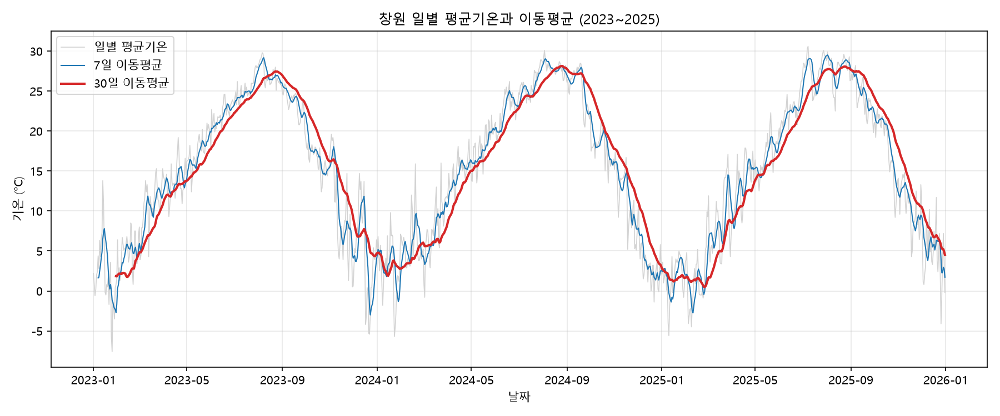
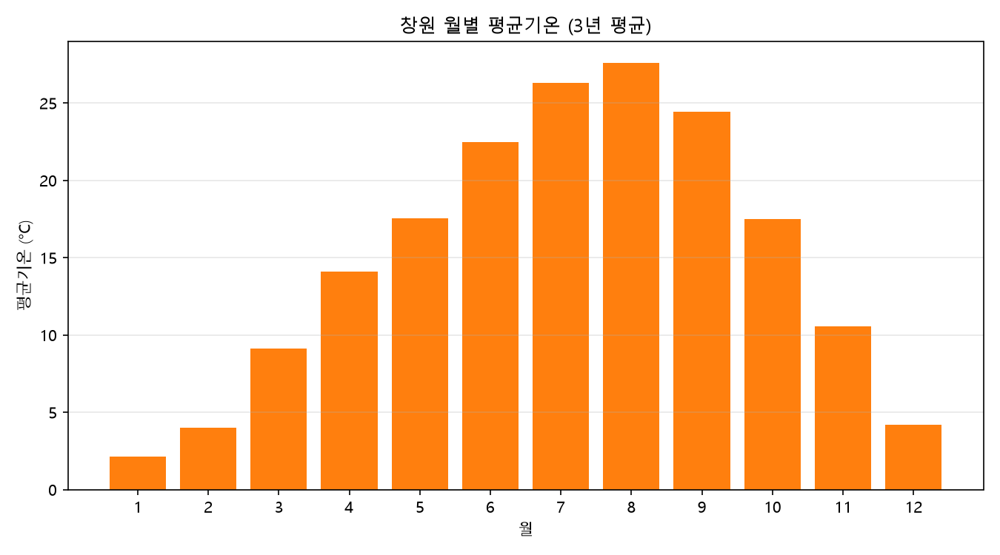
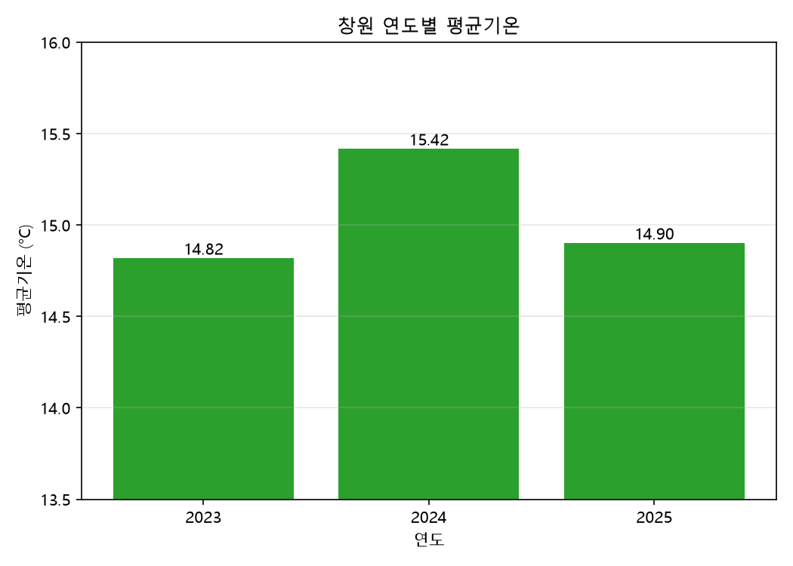
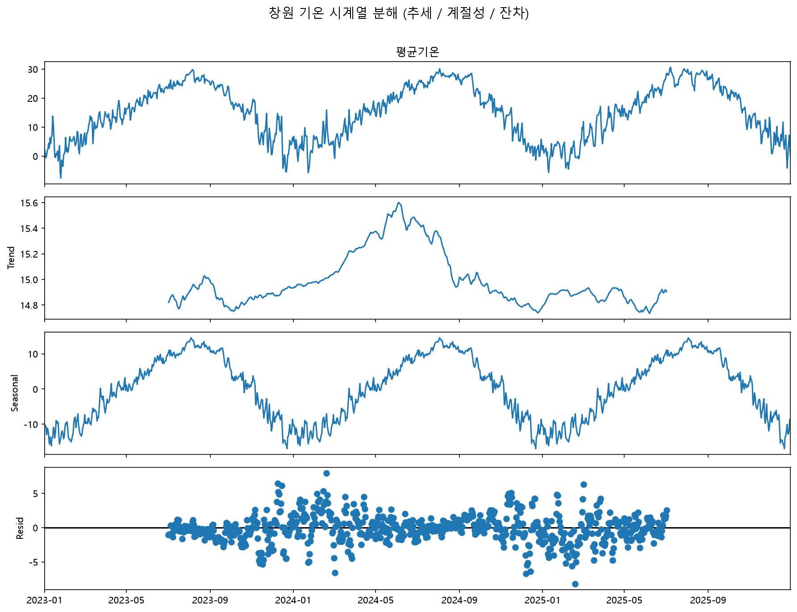
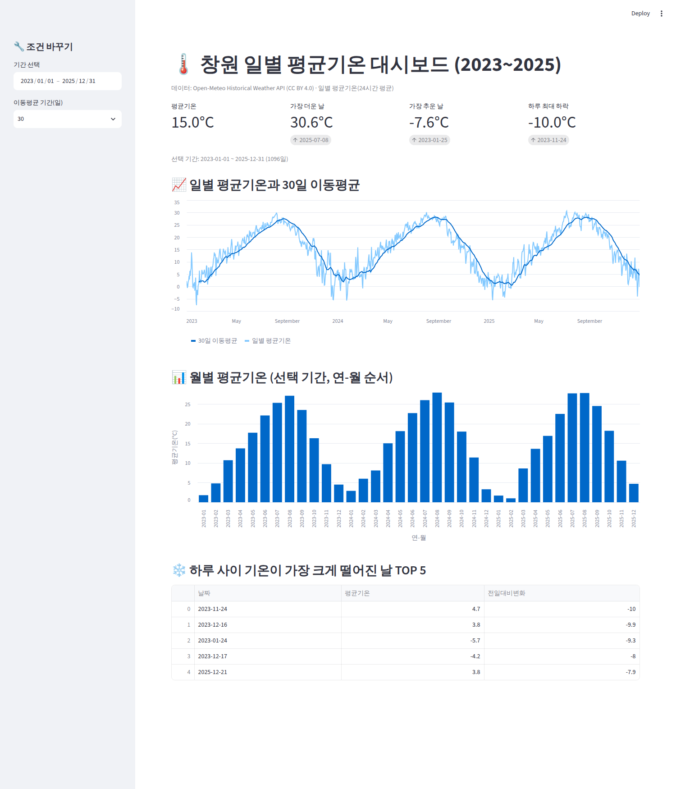
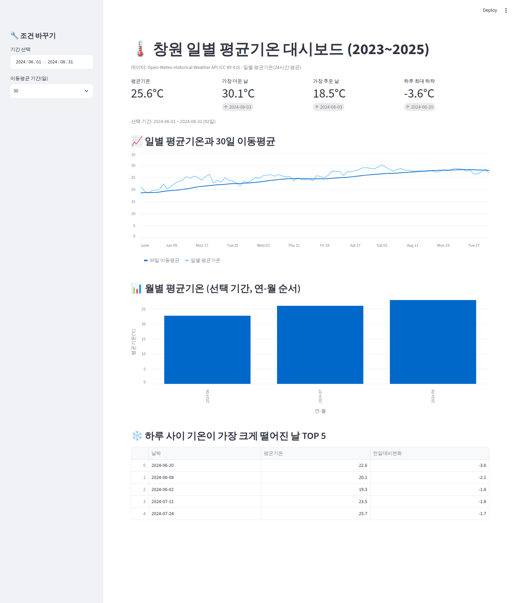
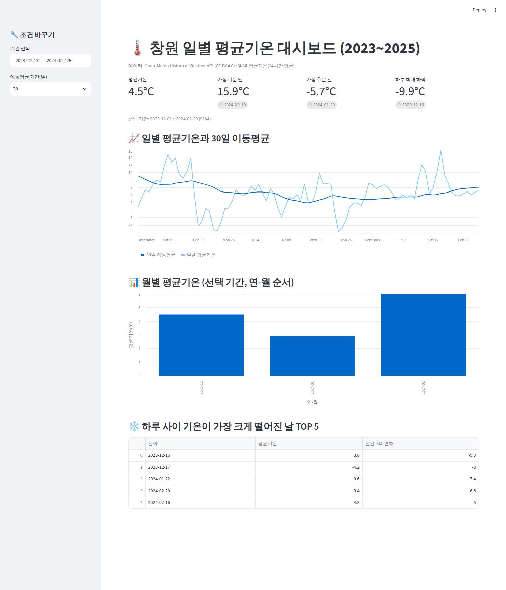
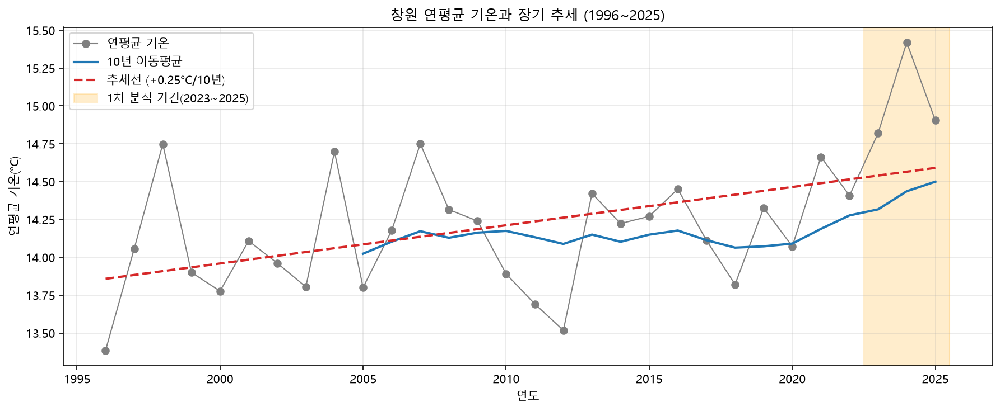
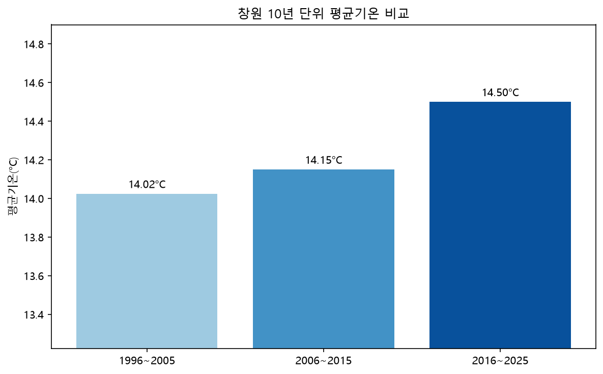

# 창원 기온 시계열 분석 리포트 (2023~2025)

## 1. 분석 주제 및 선정 이유

창원 지역의 일별 평균기온이 시간에 따라 어떻게 변해왔는지를 분석한다. 기온은 계절에 따라 규칙적으로 반복되는 대표적인 시계열 데이터이며, 누구나 직관적으로 이해할 수 있어 시계열의 핵심 개념(추세·계절성·노이즈)을 확인하기에 적합하다고 판단해 선정했다. 특히 최근 기후 변화에 대한 관심이 높은 만큼, "창원의 기온에 실제로 어떤 흐름이 있는가"를 데이터로 직접 확인해보고자 했다.

## 2. 분석 질문

1. 창원의 연평균 기온이 2023년 → 2025년 사이에 오르는(또는 내리는) 추세가 있는가?
2. 월별 기온 패턴은 매년 어떻게 반복되며, 가장 덥고 추운 달은 언제인가?
3. 하루 사이 기온 변동이 가장 큰 시기는 언제인가?
4. (평가 피드백 반영 추가) 기간을 30년(1996~2025)으로 늘리면 장기 추세가 보이는가? 그리고 2023~2025는 30년 중 어느 정도 수준인가?

## 3. 데이터 설명

- **출처**: Open-Meteo Historical Weather API (archive-api.open-meteo.com)
- **지역**: 창원 (위도 35.23, 경도 128.68)
- **기간**: 2023-01-01 ~ 2025-12-31 (약 3년) — 1차 분석
- **장기 데이터(추가)**: 1996-01-01 ~ 2025-12-31 (30년, 10,958일) — `data/changwon_temperature_1996_2025.csv`, 같은 출처·같은 지점. 결측치 0개, 날짜 누락 없음. 2023~2025 구간 1,096일이 1차 데이터와 모두 같은 값임을 확인(검증).
- **데이터 수**: 1,096일 (2024년 윤년 포함)
- **데이터 항목**: 일별 평균기온 (temperature_2m_mean, 단위 °C)
- **수집 방법**: Python `requests`로 API에 요청 → `pandas`로 표 변환 → `data/changwon_temperature_2023_2025.csv`로 저장
- **라이선스**: Open-Meteo (CC BY 4.0, 출처 표기 조건). "Weather data by Open-Meteo.com"

### 데이터 정제

결측치와 이상치를 점검한 결과, 빈 값이 0개였고 날짜도 빠짐없이 연속적(기간상 1,096일 = 실제 1,096일)이었으며 기온 값도 정상 범위(최고 30.6°C 등)였다. 따라서 별도의 정제 없이 원본 데이터를 그대로 사용했다.

### 적용한 시계열 분석 기법

- **이동평균(7일·30일)**: 일별 변동을 완화해 큰 흐름을 확인
- **변화율(전일 대비)**: 하루 사이 기온 변동이 큰 시기를 탐색
- **월별·연도별 집계**: 계절 패턴과 연도별 평균 비교
- **장기 추세선(직선 맞추기)·10년 이동평균·10년 단위 집계**: 30년 데이터로 장기 경향 확인 (`notebooks/02_장기추세_30년.ipynb`)
- **시계열 분해(보너스 ②)**: 추세/계절성/잔차 분리
- **분석 결과 대시보드(보너스 ①)**: 기간·이동평균 기간을 바꿔 가며 탐색 (`app.py`)

## 4. 분석 결과 및 시각화

### 4-1. 일별 평균기온과 이동평균



회색은 일별 평균기온, 파란선은 7일, 빨간선은 30일 이동평균이다. 일별 값은 매우 들쭉날쭉하지만, 30일 이동평균선을 보면 매년 여름에 높고 겨울에 낮은 부드러운 산 모양이 규칙적으로 반복된다.

### 4-2. 월별 평균기온



3년 평균 기준 월별 평균기온은 1월 2.1°C(최저)에서 시작해 8월 27.6°C(최고)까지 오른 뒤 다시 내려온다. 여름과 겨울의 차이는 약 25.5°C에 달한다.

| 월 | 1 | 2 | 3 | 4 | 5 | 6 | 7 | 8 | 9 | 10 | 11 | 12 |
|----|----|----|----|----|----|----|----|----|----|----|----|----|
| 평균기온(°C) | 2.1 | 4.0 | 9.1 | 14.1 | 17.6 | 22.5 | 26.3 | 27.6 | 24.5 | 17.5 | 10.6 | 4.2 |

### 4-3. 연도별 평균기온



연평균 기온은 2023년 14.82°C, 2024년 15.42°C, 2025년 14.90°C이다. 2024년이 가장 따뜻했으며, 2025년은 다시 2023년과 비슷한 수준으로 돌아왔다. (작은 차이를 보기 쉽게 y축을 13.5°C부터 시작해 확대했다.)

### 4-4. 시계열 분해 (보너스 ②)



기온 데이터를 추세(Trend)·계절성(Seasonal)·잔차(Residual)로 분해했다. 계절성 성분은 매년 동일한 큰 물결로 규칙적으로 반복되며, 추세 성분은 2024년 무렵 완만하게 높아졌다가 내려오는 모습을 보인다. 잔차는 두 성분으로 설명되지 않는 불규칙한 변동을 나타낸다.

### 4-5. 분석 결과 대시보드 (보너스 ①)

기간과 이동평균 일수를 바꿔 가며 기온 흐름을 탐색할 수 있는 웹 대시보드입니다. (`app.py`)

#### 실행 방법

```
pip install -r requirements.txt
streamlit run app.py
```

브라우저에서 `http://localhost:8501`이 열립니다. 주소 뒤에 `?start=2024-06-01&end=2024-08-31&ma=7`처럼 붙이면 해당 조건으로 바로 열립니다.

#### 화면 구성

- **왼쪽 사이드바**: 기간 선택, 이동평균 기간(7·14·30·60일) 선택
- **요약 카드**: 선택 기간의 평균기온, 가장 더운 날, 가장 추운 날, 하루 최대 하락
- **그래프**: 일별 평균기온 + 이동평균선, 연-월별 평균기온 막대그래프
- **표**: 하루 사이 기온이 가장 크게 떨어진 날 TOP 5

#### 기간/조건 변경 시나리오

**① 전체 기간 (2023-01-01 ~ 2025-12-31, 30일 이동평균)**
30일 이동평균선이 매년 여름에 오르고 겨울에 내려가는 계절 패턴이 3번 반복된다. 하루 최대 하락은 2023-11-24(−10.0°C)이다.



**② 2024년 여름으로 좁히기 (2024-06-01 ~ 2024-08-31)**
평균 25.6°C, 가장 더운 날은 2024-08-03(30.1°C)이다. 하루 최대 하락이 −3.6°C에 그쳐 여름은 기온이 안정적이다.



**③ 같은 여름, 이동평균을 7일로 바꾸기**
7일 이동평균은 일별 기온을 더 가깝게 따라가며 짧은 더위·주춤함이 드러나고, 30일은 큰 흐름만 남긴다. 목적에 따라 평균 기간을 골라야 함을 확인할 수 있다.


**④ 겨울로 바꾸기 (2023-12-01 ~ 2024-02-29)**
평균 4.5°C, 하루 최대 하락 −9.9°C(2023-12-16)로 여름보다 일간 변동이 훨씬 크다. 일별 선이 약 −6°C~16°C 사이를 크게 오르내린다. → REPORT.md 인사이트 3(급변은 겨울에 집중)을 대시보드로도 확인할 수 있다.



### 4-6. 장기 추세 확장: 30년 (1996~2025) — 평가 피드백 반영

1차 분석의 한계("3년으로는 추세를 단정하기 어렵다")를 보완하기 위해, 같은 출처·같은 지점으로 기간을 30년으로 늘렸다. 30년은 기상학에서 평년값(기후 평균)을 낼 때 쓰는 표준 기간이다. 분석 코드는 `notebooks/02_장기추세_30년.ipynb`, 공통 함수는 `src/weather_utils.py`에 있다.



- 30년 연평균에 직선을 맞추면 기울기는 **10년당 +0.25°C**(30년 동안 약 +0.7°C)이다.
- 연평균은 해마다 오르내림이 크다(예: 2007년 14.75°C → 2012년 13.52°C). 30년 중 가장 추운 해는 1996년(13.39°C)이다.
- **2024년(15.42°C)·2025년(14.90°C)·2023년(14.82°C)이 30년 중 가장 따뜻한 1·2·3위**였다. 1차 분석 기간이 30년 중 가장 따뜻한 3년이었던 것이다.



| 구간 | 평균기온 |
|---|---|
| 1996~2005 | 14.02°C |
| 2006~2015 | 14.15°C |
| 2016~2025 | 14.50°C |

- 10년 단위로 묶으면 구간마다 평균이 올라가며, 첫 10년보다 마지막 10년이 **+0.48°C** 높다. (그래프는 작은 차이를 보기 위해 세로축을 0이 아닌 값부터 시작했다.)
- **왜 3년으로는 부족했나**: 30년 안에서 연속된 3년 구간 28개마다 기울기를 구해 보면, −0.49 ~ +0.68°C/년으로 들쭉날쭉하고 **28개 중 12개는 오히려 '내려가는' 기울기**였다. 즉 3년만 보면 어느 3년을 고르느냐에 따라 결론이 정반대가 될 수 있다.

## 5. 인사이트

### 인사이트 1 — 창원 기온은 계절성이 매우 강하다

- **관찰(Fact)**: 월별 평균이 1월 2.1°C(최저) → 8월 27.6°C(최고)로 약 25.5°C 차이. 시계열 분해의 계절성 성분이 매년 규칙적인 물결로 반복됨.
- **원인(Why)**: 중위도 기후 특성상 여름엔 태양 고도·일사량이 높고, 겨울엔 차가운 대륙 고기압의 영향을 받기 때문으로 보임.
- **행동(Action)**: 계절 효과가 크므로 장기 추세를 보려면 반드시 계절성을 제거해야 함(이동평균·분해). 이 월별 패턴은 냉난방 수요 예측 등에 활용 가능.

### 인사이트 2 — 3년만으로는 온난화 추세를 단정할 수 없다

- **관찰(Fact)**: 연평균이 2023년 14.82°C → 2024년 15.42°C → 2025년 14.90°C. 2024년이 +0.6°C로 가장 따뜻했고 2025년은 다시 제자리.
- **원인(Why)**: 표본이 3년으로 짧아 장기 경향으로 보기 어려움. 2024년 한 해의 이상 고온(특정 기후 요인) 가능성.
- **행동(Action)**: 온난화 추세를 논하려면 10년 이상의 데이터가 필요. 기상청 장기 자료로 기간을 넓혀 재분석 제안.
- **후속 분석(평가 피드백 반영, 4-6절)**: 30년(1996~2025)으로 늘린 결과 10년당 +0.25°C의 완만한 상승 경향이 보였고, 2023~2025는 30년 중 가장 따뜻한 3년이었다. 반대로 30년 안의 3년 구간 28개 중 12개는 하강 기울기여서, "3년으로는 단정할 수 없다"던 1차 판단이 타당했음도 확인했다. 다만 상승의 원인(지구온난화·도시화 등)은 이 데이터만으로 가릴 수 없어 가설로 남긴다.

### 인사이트 3 — 하루 사이 기온 급변은 초겨울~한겨울(11~1월)에 집중된다

- **관찰(Fact)**: 전일 대비 기온이 가장 크게 떨어진 날 TOP 5가 모두 11~1월에 있다(1위 2023-11-24 −10.0°C, 2위 2023-12-16 −9.9°C, 3위 2023-01-24 −9.3°C). 월별 '하루 평균 변동폭'(전일 대비 변화의 절댓값 평균)도 12월 2.43°C·1월 2.14°C·11월 2.02°C로 가장 크고, 8월 0.66°C·7월 0.72°C로 가장 작다. 계절로 묶으면 겨울(12~2월) 평균 2.13°C, 여름(6~8월) 평균 0.81°C로 겨울의 일간 변동이 여름의 약 2.6배다.
- **원인(Why)**: 겨울철 한파(대륙 고기압) 유입 시 기온이 급강하하는 반면, 여름은 상대적으로 안정적이기 때문으로 보임.
- **행동(Action)**: 겨울철 급변 시기에 대비(건강·에너지 수요). 잔차가 크게 튄 시점을 실제 한파 기록과 대조해 검증 가능.

## 6. 결론 및 한계점

**결론**: 창원의 기온은 여름(8월) 최고·겨울(1월) 최저의 뚜렷한 계절성을 보이며, 이는 시계열 분해로도 명확히 확인되었다. 3년간의 연평균만으로는 일관된 추세를 말하기 어려웠으나, 기간을 30년으로 늘리자 10년당 +0.25°C의 완만한 상승 경향이 보였고 2023~2025는 30년 중 가장 따뜻한 3년이었다. 하루 단위 급변은 11~1월에 집중되었으며, 겨울의 일간 변동폭은 여름의 약 2.6배였다.

**한계점**
- **기간**: 1차 분석의 3년은 장기 추세를 판단하기에 부족해 30년으로 보완했다(4-6절). 다만 30년 추세선도 직선 하나로 단순화한 것이고, 통계적 유의성 검정은 하지 않았다.
- **모델 자료**: Open-Meteo는 관측소 실측이 아닌 재분석(모델) 자료라 기상청 관측값과 다를 수 있다. 특히 오래된 기간일수록 오차가 커질 수 있다.
- **단일 지표**: 평균기온만 사용했으며, 최고/최저기온·강수량·습도 등은 반영하지 않았다.
- **단일 지역**: 창원 한 곳만 분석해 지역 간 비교는 하지 못했다.
- **외부 변수 미반영**: 엘니뇨 등 기후 요인이나 도시화 효과는 고려하지 않았다.

## 7. AI 사용 로그

| 구분 | 내용 |
|------|------|
| **사용 작업** | 분석 방향·질문 설계 자문, Python 코드 작성(데이터 수집·이동평균·변화율·월별집계·시각화·시계열 분해), 개념 설명, 리포트 초안 작성 |
| **사용 이유** | 비전공자로서 시계열 분석의 흐름을 단계별로 이해하며 진행하기 위해. 코드 작성 시간을 줄이고, 개념(추세·계절성·이동평균 등)을 쉽게 익히기 위해. |
| **검증 방법** | ① 샘플링 체크: 이동평균·기온 값 일부를 직접 확인. ② 재현: 노트북을 위에서부터 순서대로 재실행해 동일 결과 확인. ③ 상식 검증: 월별 최고/최저(8월/1월), 기온 범위가 상식과 부합하는지 대조. 최종 해석과 결론은 그래프의 수치를 근거로 직접 판단함. |

> **원본 세션 로그**: 실제 주고받은 프롬프트와 AI가 생성한 코드(수집·분석·시각화·분해)의 단계별 원본 로그, 그리고 "AI 제안 vs 실제 적용" 비교는 [AI_사용로그.md](AI_사용로그.md)에서 확인할 수 있습니다.

---

## 실행 방법 (재현성)

- Python 3.10 이상
- 필요 라이브러리: `requirements.txt` 참고 (`pip install -r requirements.txt`)
- 실제 실행 환경: Python 3.13, Windows + VS Code(Jupyter 확장)
- 대시보드 실행: `streamlit run app.py` (4-5절 참고)
- 실행 순서: `analysis.ipynb`(1차 분석) → `notebooks/02_장기추세_30년.ipynb`(장기 추세)를 각각 위에서부터 순서대로 셀 실행
